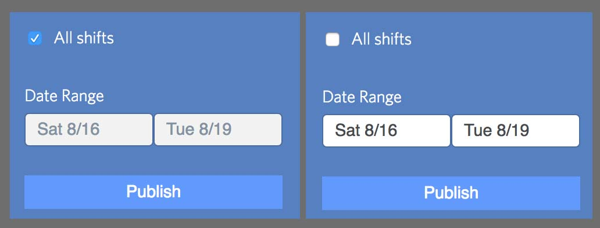

# Checkbox Disable



Disable toggles allow us to disable fields in a certain target section when 
a checkbox is clicked.

```erb
  <%= f.input :all_shifts,
    as: :boolean,
    input_html: {
      class: "disable-toggle",
      data: { target: ".posting-date-range" }
    } %>

  <div class="posting-date-range">
    <%= f.input :date_start, as: :datepicker_range %>
  </div>
```
